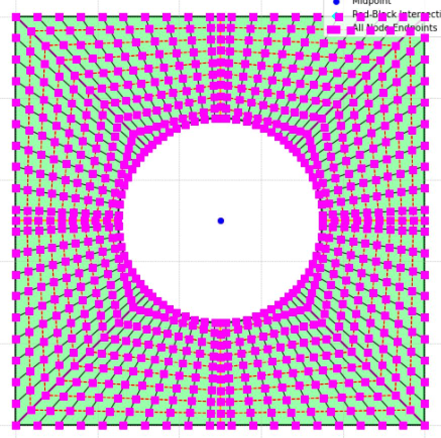
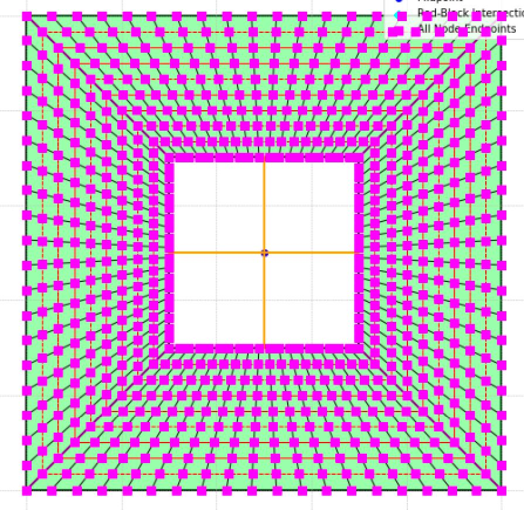
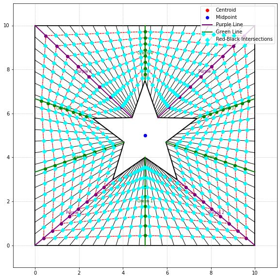
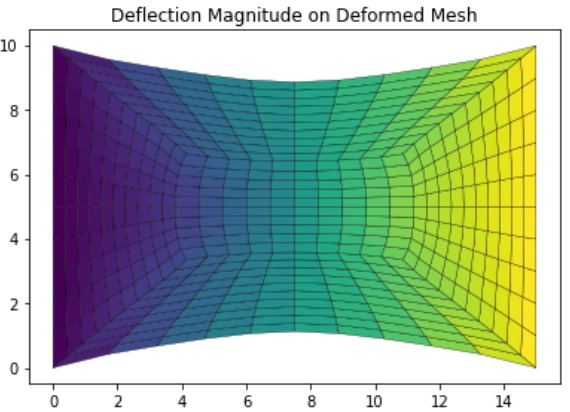

# 2D FEM Void Mesh

A finite element analysis package for 2D continuum problems with void and inclusion geometries. Supports multiple mesh types including circular, square, and rhombus voids with automatic mesh generation.



## Features

**Mesh Generation**
- Automatic void mesh generation around central cavities
- Support for Circle, Square, and Rhombus shaped voids
- Quadrilateral (D2QU4N) and Triangular (D2TR3N) elements
- Configurable mesh density and void size

**FEM Solver**
- Plane stress formulation
- Isoparametric element implementation
- Gauss quadrature integration
- Multiple boundary condition types

**Boundary Conditions**
- Extension (uniaxial tension)
- Expansion (biaxial tension)
- Shear deformation

**Post-Processing**
- Stress field visualization (σxx, σyy, σxy)
- Displacement contours
- Deformed shape overlay
- Multiple colormap options

## Screenshots

| Square Void | Star Void | Deflection |
|:-----------:|:---------:|:----------:|
|  |  |  |

## Installation

```bash
git clone https://github.com/[YOUR_USERNAME]/2D-FEM-Void-Mesh.git
cd 2D-FEM-Void-Mesh
pip install -r requirements.txt
```

## Usage

**GUI Mode:**
```bash
python main.py
```

**Demo Mode:**
```bash
python main.py --mode demo
```

**Python API:**
```python
from src.mesh_generator import void_mesh
from src.fem_solver import FEM2D

# Generate mesh with circular void
NL, EL = void_mesh(1.0, 1.0, 8, 5, 0.2, 'D2QU4N', 'Circle')

# Run analysis
fem = FEM2D(NL, EL, E=210e9, nu=0.3)
fem.solve('extension', 0.1)
results = fem.get_results()

print(f"Max stress: {results['stress_xx'].max():.2e} Pa")
```

## Project Structure

```
2D-FEM-Void-Mesh/
├── main.py              # Entry point
├── requirements.txt     
├── src/
│   ├── __init__.py
│   ├── mesh_generator.py  # Void mesh algorithms
│   ├── fem_solver.py      # 2D FEM implementation
│   └── gui.py             # Tkinter interface
├── examples/
└── screenshots/
```

## Technical Details

**Element Types:**
- D2QU4N: 4-node bilinear quadrilateral
- D2TR3N: 3-node linear triangle

**Constitutive Model:**
Plane stress elasticity:
```
σ = C · ε
C = E/(1-ν²) × [1  ν  0; ν  1  0; 0  0  (1-ν)/2]
```

**Mesh Algorithm:**
The void mesh generator creates a structured mesh by:
1. Dividing domain into 4 regions around the void
2. Mapping boundary nodes to void perimeter
3. Interpolating interior nodes radially
4. Connecting nodes into quadrilateral elements

## Team

- Hüseyin Tunç - Lead Developer
- [Team Member 2] - [Role]
- [Team Member 3] - [Role]
- [Team Member 4] - [Role]

*Developed as part of ME 362 Finite Element Methods course at Bilkent University*

## License

MIT License - See LICENSE file for details.
